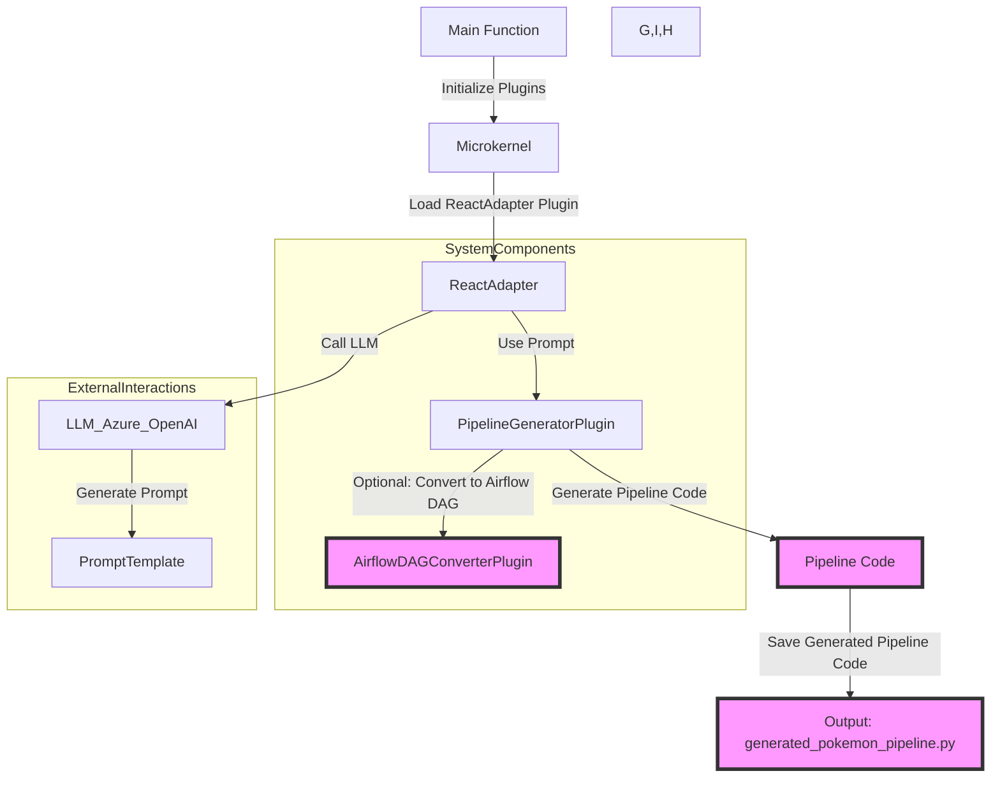
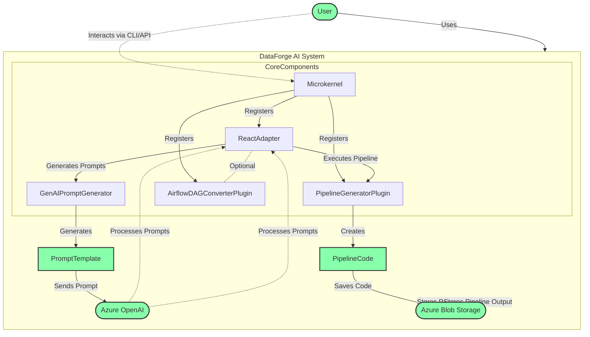

# dataforge-ai

[](https://img.shields.io/github/v/release/tvanderv92/dataforge-ai)
[](https://github.com/tvanderv92/dataforge-ai/actions/workflows/main.yml?query=branch%3Amain)
[](https://codecov.io/gh/tvanderv92/dataforge-ai)
[](https://img.shields.io/github/commit-activity/m/tvanderv92/dataforge-ai)
[](https://img.shields.io/github/license/tvanderv92/dataforge-ai)

DataForge-AI is a Python framework that automates the creation of data pipelines using Generative AI. It integrates AlphaCodium for code generation and DLHub for building pipelines that can be converted into Airflow DAGs, all within a Microkernel architecture.

- **Github repository**: <https://github.com/tvanderv92/dataforge-ai/>
- **Documentation** <https://tvanderv92.github.io/dataforge-ai/>

## Getting started with your project

First, create a repository on GitHub with the same name as this project, and then run the following commands:

```bash
git init -b main
git add .
git commit -m "init commit"
git remote add origin git@github.com:tvanderv92/dataforge-ai.git
git push -u origin main
```

Finally, install the environment and the pre-commit hooks with

```bash
make install
```

You are now ready to start development on your project!
The CI/CD pipeline will be triggered when you open a pull request, merge to main, or when you create a new release.

To finalize the set-up for publishing to PyPi or Artifactory, see [here](https://fpgmaas.github.io/cookiecutter-poetry/features/publishing/#set-up-for-pypi).
For activating the automatic documentation with MkDocs, see [here](https://fpgmaas.github.io/cookiecutter-poetry/features/mkdocs/#enabling-the-documentation-on-github).
To enable the code coverage reports, see [here](https://fpgmaas.github.io/cookiecutter-poetry/features/codecov/).

## Releasing a new version

## Project Structure

```
.
├── codecov.yaml
├── CONTRIBUTING.md
├── dataforge_ai
│   ├── core
│   │   ├── microkernel.py
│   │   ├── plugin_interface.py
│   │   └── __init__.py
│   ├── main.py
│   ├── plugins
│   │   ├── genai_prompt_generator.py
│   │   ├── react_adapter.py
│   │   └── __init__.py
│   ├── tests
│   │   └── __init__.py
│   ├── utils
│   │   └── __init__.py
│   └── __init__.py
```

---

Repository initiated with [fpgmaas/cookiecutter-poetry](https://github.com/fpgmaas/cookiecutter-poetry).


---





